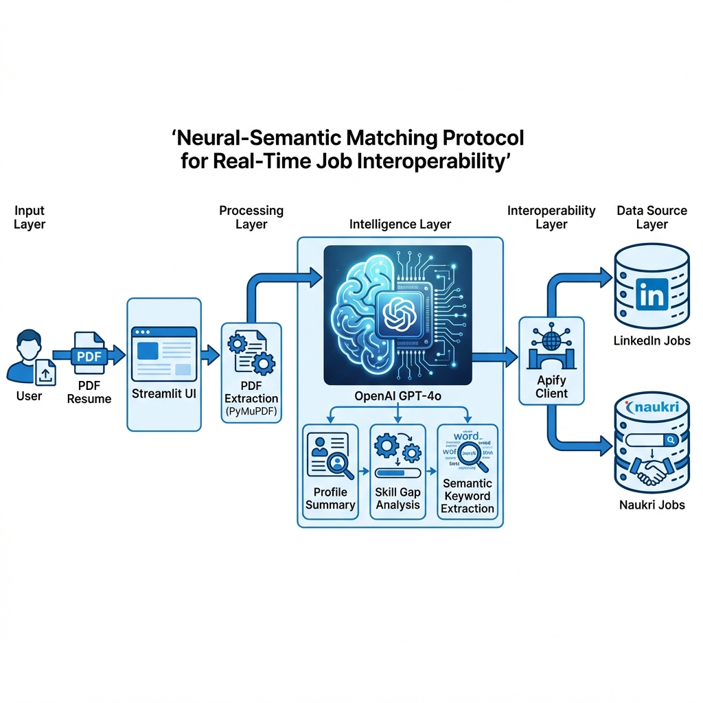

# Real-Time Job Interoperability System

<div align="center">

[](https://www.python.org/downloads/)
[](LICENSE)
[]()
[](https://www.python.org/dev/peps/pep-0008/)

An **AI-powered Neural-Semantic Job Interoperability System** that intelligently matches candidates to jobs by analyzing resumes and integrating real-time job market data from LinkedIn and Naukri.

[Features](#features) • [Installation](#installation) • [Quick Start](#quick-start) • [Architecture](#architecture) • [Documentation](#documentation)

</div>

---

## 📋 Overview

This project bridges the gap between unstructured candidate data (resumes) and structured job listings through AI-powered semantic matching. It leverages OpenAI's GPT-4o for intelligent analysis and Apify for real-time job aggregation across major job platforms.

### 🎯 Key Capabilities

- **Neural-Semantic Matching**: Intelligently match candidate profiles to job opportunities
- **Real-time Data Interoperability**: Fetch and integrate live job listings from LinkedIn and Naukri
- **Intelligent Resume Analysis**: Extract, summarize, and analyze resumes with AI
- **Skill Gap Identification**: Identify missing skills and suggest career development paths
- **Career Roadmap Generation**: Provide personalized career progression recommendations

---

## ✨ Features

- 📄 **Resume Processing**: Upload and extract text from PDF resumes using PyMuPDF
- 🤖 **AI-Powered Analysis**: Leverage OpenAI GPT-4o for resume summarization and analysis
- 🔍 **Skill Gap Analysis**: Identify skill gaps and provide recommendations
- 🗺️ **Career Roadmap**: Generate personalized career development paths
- 💼 **Job Recommendations**: Get intelligent job matches from LinkedIn and Naukri
- 🔌 **MCP Server**: Model Context Protocol server for integrated job fetching tools
- 📊 **Data Validation**: Built-in guardrails for response validation
- 🎛️ **Web Interface**: Interactive Streamlit-based user interface

---

## 🏗️ Architecture



The system follows a modular architecture with three main layers:

1. **Data Processing Layer**: Resume parsing and text extraction
2. **AI Intelligence Layer**: Profile analysis, skill gap identification, and career planning
3. **Integration Layer**: Real-time job aggregation and semantic search

For detailed architecture information, see [Architecture Documentation](docs/ARCHITECTURE.md).

---

## 📦 Prerequisites

- **Python**: 3.13 or higher
- **OpenAI API Key**: For GPT-4o integration ([Get API Key](https://platform.openai.com/api-keys))
- **Apify API Token**: For job scraping ([Create Account](https://apify.com))

### Optional

- **UV Package Manager**: For faster dependency installation ([Learn More](https://docs.astral.sh/uv/))

---

## 🚀 Installation

### Option 1: Using pip (Standard)

1. **Clone or download this repository**:
   ```bash
   git clone <repository-url>
   cd "Real-Time Job Interoperability"
   ```

2. **Create a Python virtual environment** (recommended):
   ```bash
   python -m venv venv
   
   # On Windows:
   venv\Scripts\activate
   
   # On macOS/Linux:
   source venv/bin/activate
   ```

3. **Install dependencies**:
   ```bash
   pip install -r requirements.txt
   ```

### Option 2: Using UV Package Manager (⚡ Faster)

1. **Install UV** (if not already installed):
   ```bash
   pip install uv
   ```

2. **Clone or download this repository**:
   ```bash
   git clone <repository-url>
   cd "Real-Time Job Interoperability"
   ```

3. **Install dependencies with UV**:
   ```bash
   uv pip install -r requirements.txt
   ```

**Benefits of UV**:
- ⚡ 10-100x faster dependency resolution
- 🔒 Predictable, reproducible builds
- 🎯 Built-in virtual environment management
- 📦 Drop-in pip replacement

### Configuration

4. **Create a `.env` file** in the root directory:
   ```bash
   OPENAI_API_KEY=your_openai_api_key_here
   APIFY_API_TOKEN=your_apify_api_token_here
   ```

---

## 🎯 Quick Start

### Running the Web Application

Launch the interactive Streamlit application:

```bash
streamlit run app.py
```

Then:
1. Upload your resume (PDF format)
2. Review AI-powered analysis
3. Explore job recommendations
4. Get personalized career insights

### Running the MCP Server

For programmatic job fetching:

```bash
python mcp_server.py
```

### Running Utility Demonstrations

Explore individual components:

```bash
python all-utils/main.py
```

### Running Guardrails Evaluation

Test response validation:

```bash
python guardrails_eval.py
```

### Running Demo

Interactive demo of core features:

```bash
python demo.py
```

---

## 📁 Project Structure

```
.
├── README.md                          # Project documentation
├── pyproject.toml                     # Project metadata and dependencies
├── requirements.txt                   # Python dependencies
├── .env.example                       # Environment variables template
│
├── 📱 Application Files
├── app.py                             # Main Streamlit web application
├── demo.py                            # Interactive demo script
├── mcp_server.py                      # MCP server for job fetching
├── guardrails_eval.py                 # Response validation testing
│
├── 📦 src/                            # Source code
│   ├── __init__.py
│   ├── helper.py                      # PDF extraction & OpenAI integration
│   └── job_api.py                     # Job scraping (LinkedIn, Naukri)
│
├── 🛠️ all-utils/                      # Utility modules
│   ├── main.py                        # Main utility runner
│   ├── requirements.txt               # Utility dependencies
│   ├── utilities/                     # Utility scripts
│   │   ├── pydantic_models.py         # Data validation models
│   │   ├── query_validation_transformation.py
│   │   ├── logging_example.py
│   │   ├── mem0_example.py
│   │   └── *.ipynb                    # Jupyter notebooks
│   └── db/                            # Vector database
│       └── chroma.sqlite3             # Chroma vector store
│
├── 📚 Assets/                         # Project assets
│   └── architecture_JjvaSwM.jpg       # Architecture diagram
│
├── 📖 docs/                           # Project documentation (see docs/ folder)
│   ├── INSTALLATION.md                # Detailed installation guide
│   ├── ARCHITECTURE.md                # System architecture documentation
│   ├── API.md                         # API documentation
│   └── CONFIGURATION.md               # Configuration guide
│
├── 🔄 workflows/                      # Mermaid flowchart diagrams
│   ├── system_flow.md                 # Main system workflow
│   ├── resume_processing.md           # Resume processing pipeline
│   ├── job_matching.md                # Job matching algorithm
│   └── data_interoperability.md       # Data integration workflow
│
└── 📋 metadata.txt                    # Project metadata and learning outcomes
```

---

## 💾 Dependencies

### Core Dependencies

| Package | Purpose | Version |
|---------|---------|---------|
| **Streamlit** | Web interface framework | Latest |
| **OpenAI** | GPT-4o API integration | >=1.84.0 |
| **PyMuPDF (fitz)** | PDF text extraction | >=1.26.0 |
| **Apify Client** | Job scraping integration | >=1.10.0 |
| **python-dotenv** | Environment variable management | >=1.1.0 |
| **MCP** | Model Context Protocol | >=1.9.2 |
| **Guardrails AI** | Response validation | Latest |

For complete dependency list, see [requirements.txt](requirements.txt)

---

## 📚 Documentation

- 📖 **[Installation Guide](docs/INSTALLATION.md)** - Detailed setup instructions
- 🏗️ **[Architecture Documentation](docs/ARCHITECTURE.md)** - System design and components
- 🔌 **[API Documentation](docs/API.md)** - API endpoints and functions
- ⚙️ **[Configuration Guide](docs/CONFIGURATION.md)** - Environment and settings

### Workflow Diagrams

- 🔄 **[System Flow](workflows/system_flow.md)** - Main application workflow
- 📄 **[Resume Processing](workflows/resume_processing.md)** - Resume analysis pipeline
- 💼 **[Job Matching](workflows/job_matching.md)** - Semantic matching algorithm
- 🔗 **[Data Interoperability](workflows/data_interoperability.md)** - Data integration flow

---

## 🔑 Key Technologies

| Technology | Purpose |
|-----------|---------|
| **Python 3.13+** | Programming language |
| **Streamlit** | Web UI framework |
| **OpenAI GPT-4o** | AI/LLM engine |
| **PyMuPDF** | PDF processing |
| **Apify** | Web scraping platform |
| **MCP** | Tool protocol |
| **Chroma** | Vector database |

---

## 🎓 Learning Outcomes

This project teaches:

- ✅ Integrating LLMs (OpenAI GPT-4o) into production applications
- ✅ Building interactive web applications with Streamlit
- ✅ Neural-Semantic Matching for unstructured data
- ✅ PDF parsing and unstructured data processing
- ✅ Real-time data interoperability and web scraping
- ✅ Advanced prompt engineering techniques
- ✅ Building scalable AI-powered systems

---

## 🤝 Contributing

We welcome contributions! Please:

1. Fork the repository
2. Create a feature branch (`git checkout -b feature/amazing-feature`)
3. Commit your changes (`git commit -m 'Add amazing feature'`)
4. Push to the branch (`git push origin feature/amazing-feature`)
5. Open a Pull Request

---

## 📝 License

This project is licensed under the MIT License - see the [LICENSE](LICENSE) file for details.

---

## 🙋 Support

For questions, issues, or suggestions:
- 📧 Open an issue on GitHub
- 💬 Check existing documentation in the [docs](docs/) folder
- 📖 Review workflow diagrams in the [workflows](workflows/) folder

---

## 🙏 Acknowledgments

- OpenAI for GPT-4o API
- Apify for job scraping capabilities
- Streamlit for the web framework
- The open-source community

---

<div align="center">

**Made with ❤️ for AI-powered career matching**

⭐ If you found this helpful, please consider giving it a star!

</div>

This project is licensed under the MIT License.