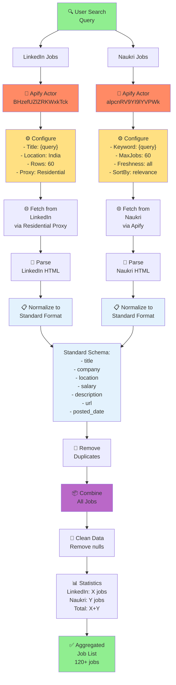
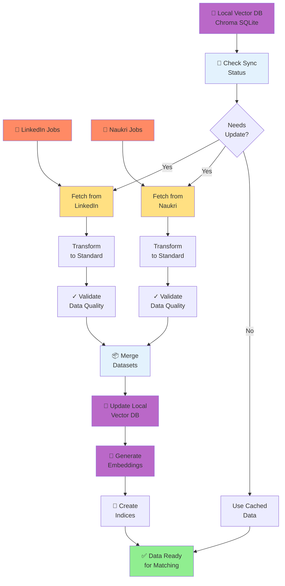
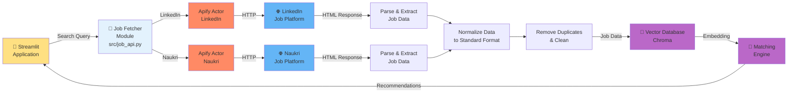
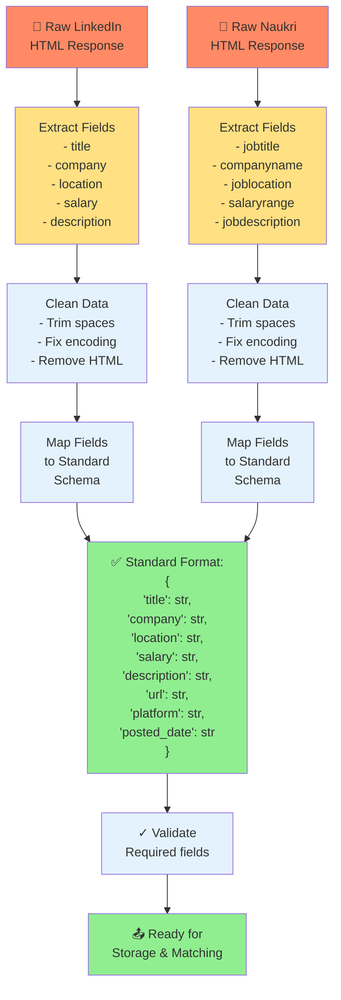
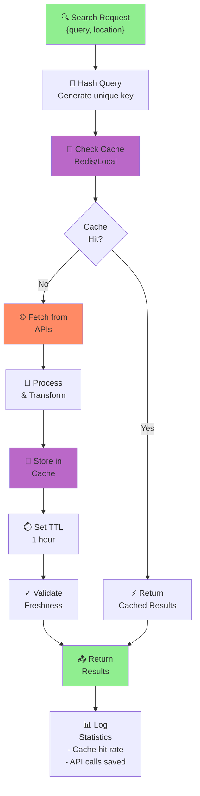
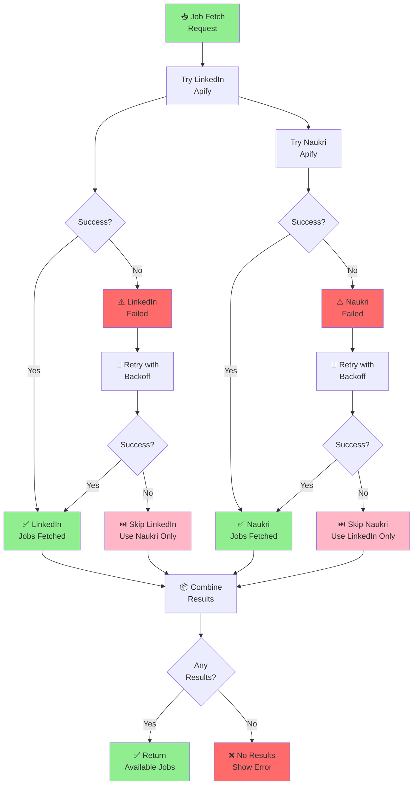
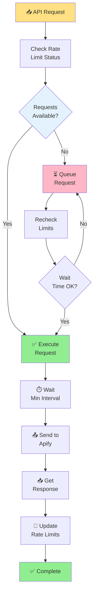

# Data Interoperability & Integration Flow

## Multi-Platform Job Aggregation

---

## Data Synchronization Pipeline

---

## API Integration Architecture

---

## Data Transformation Pipeline

---

## Caching & Optimization

---

## Error Handling & Fallback

---

## Rate Limiting & Throttling

---

## See Also

- [System Flow Diagram](system_flow.md)
- [Resume Processing Flow](resume_processing.md)
- [Job Matching Flow](job_matching.md)

