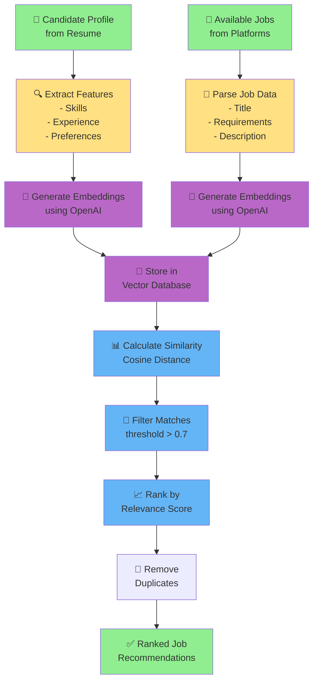
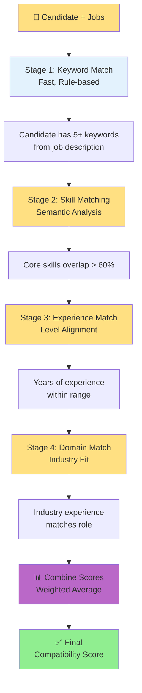
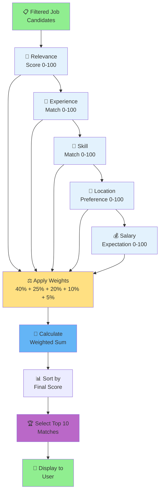
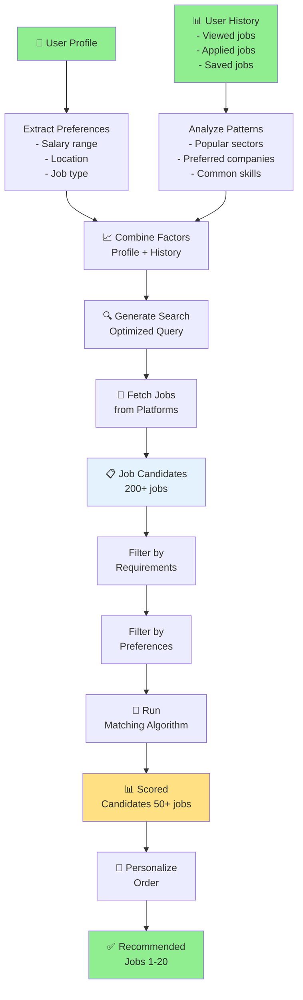
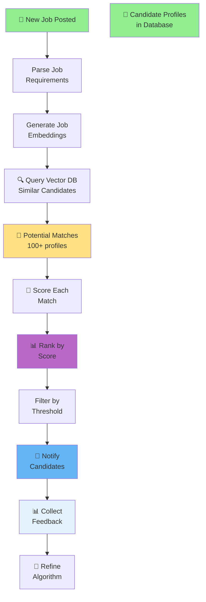
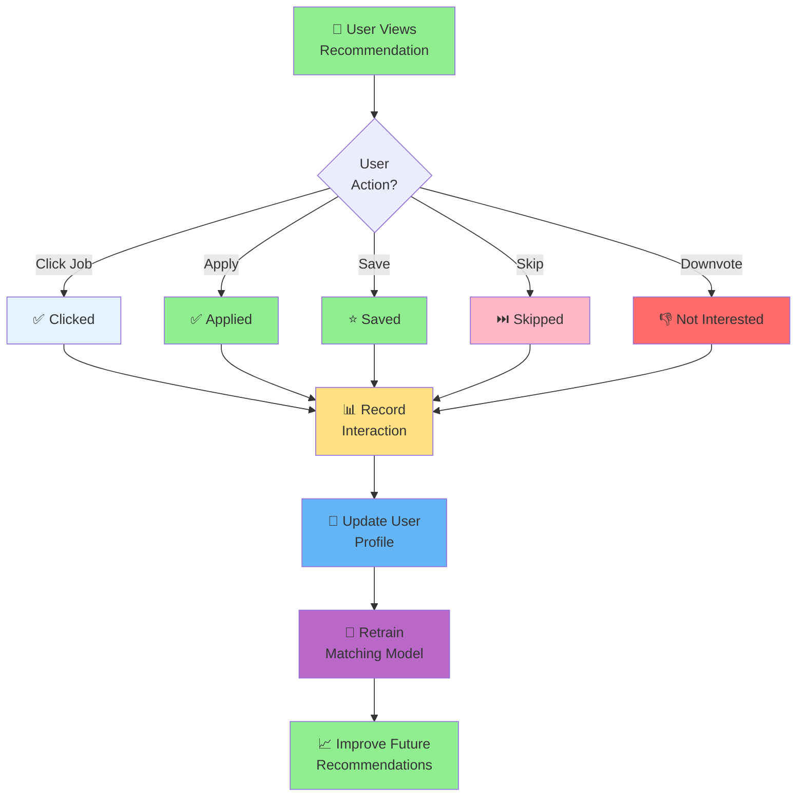
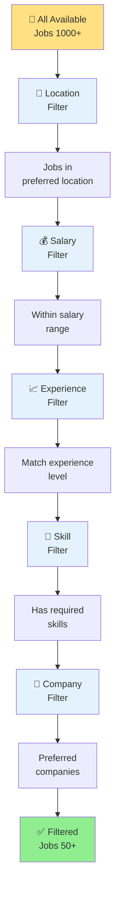

# Job Matching & Recommendation Flow

## Neural-Semantic Matching Algorithm

---

## Matching Stages

---

## Ranking Algorithm

---

## Recommendation Engine

---

## Real-time Matching Flow

---

## Feedback Loop

---

## Filtering Strategy

---

## See Also

- [System Flow Diagram](system_flow.md)
- [Resume Processing Flow](resume_processing.md)
- [Data Interoperability Flow](data_interoperability.md)

