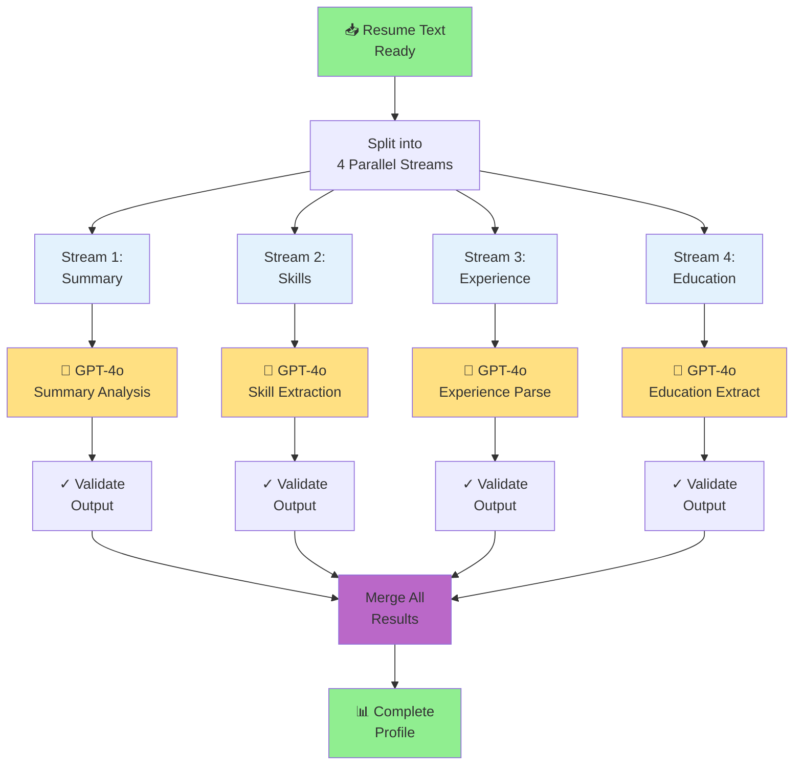
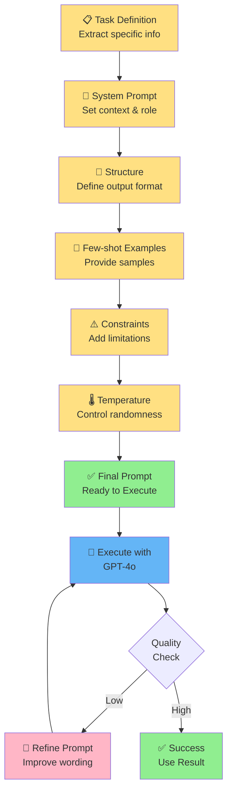
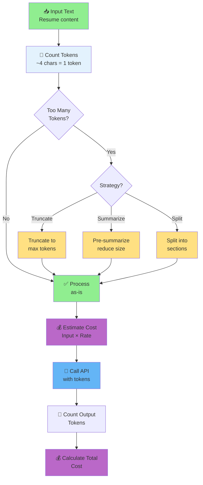
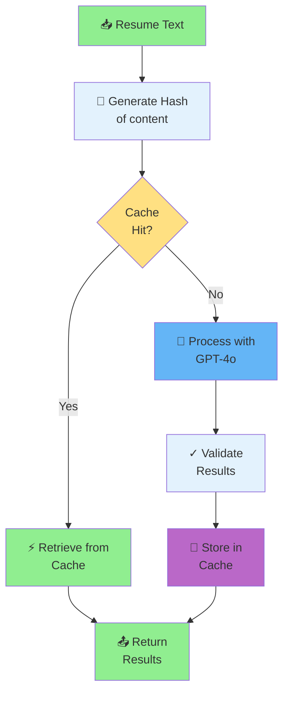

# Resume Processing Pipeline

## Complete Resume Analysis Flow

```mermaid
flowchart TD
    Input["📥 Input: PDF Resume<br/>from User Upload"]
    Input --> Validate["✓ File Validation<br/>- Check format<br/>- Verify size<br/>- Scan for corruption"]
    
    Validate --> Valid{File<br/>Valid?}
    Valid -->|No| Reject["❌ Reject File<br/>Invalid Format or Size"]
    Valid -->|Yes| Extract
    
    Reject --> Error1["Return Error<br/>to User"]
    
    Extract["📄 Extract Text<br/>using PyMuPDF"]
    Extract --> CheckEmpty{Text<br/>Empty?}
    CheckEmpty -->|Yes| Error2["❌ No Readable Text<br/>File may be image-based"]
    CheckEmpty -->|No| Clean
    
    Clean["🧹 Clean & Normalize<br/>- Remove duplicates<br/>- Fix encoding<br/>- Trim whitespace"]
    Clean --> Tokenize["🔢 Tokenize Text<br/>Count tokens for API"]
    
    Tokenize --> CheckTokens{Tokens<br/>Too Many?}
    CheckTokens -->|Yes| Truncate["✂️ Truncate to<br/>Max Tokens"]
    CheckTokens -->|No| Truncate
    
    Truncate --> Summary["🤖 Generate Summary<br/>via GPT-4o"]
    
    Summary --> SummaryPrompt["
    Prompt:
    Summarize this resume
    in 100-150 words,
    highlighting key skills
    and experience
    "]
    
    SummaryPrompt --> Skills["🎯 Extract Key Skills<br/>via GPT-4o"]
    
    Skills --> SkillsPrompt["
    Prompt:
    List the top 10
    technical and
    soft skills
    "]
    
    SkillsPrompt --> Experience["📈 Analyze Experience<br/>via GPT-4o"]
    
    Experience --> ExpPrompt["
    Prompt:
    Summarize work
    experience,
    technologies,
    and achievements
    "]
    
    ExpPrompt --> Education["🎓 Extract Education<br/>via GPT-4o"]
    
    Education --> EduPrompt["
    Prompt:
    List degrees,
    certifications,
    and courses
    "]
    
    EduPrompt --> Validate2["✓ Validate Outputs<br/>using Guardrails AI"]
    
    Validate2 --> Valid2{Output<br/>Valid?}
    Valid2 -->|No| RetryGPT["🔄 Retry with<br/>Different Prompt"]
    RetryGPT --> Summary
    Valid2 -->|Yes| Combine
    
    Combine["📦 Combine Results<br/>into Profile Object"]
    
    Combine --> Store["💾 Store in<br/>Vector Database"]
    Store --> Generate["🔍 Generate Embeddings<br/>for Similarity Search"]
    
    Generate --> Output["📊 Output: Structured<br/>Resume Profile"]
    
    Output --> End(["✅ Processing<br/>Complete"])
    Error1 --> End
    Error2 --> End
    
    style Input fill:#90EE90
    style Validate fill:#E3F2FD
    style Extract fill:#E3F2FD
    style Clean fill:#E3F2FD
    style Summary fill:#FFE082
    style Skills fill:#FFE082
    style Experience fill:#FFE082
    style Education fill:#FFE082
    style Validate2 fill:#E3F2FD
    style Combine fill:#E3F2FD
    style Store fill:#BA68C8
    style Output fill:#90EE90
    style Reject fill:#FF6B6B
    style Error1 fill:#FF6B6B
    style Error2 fill:#FF6B6B
    style End fill:#90EE90
```

---

## Parallel Processing Architecture

---

## Data Transformation Pipeline

```mermaid
flowchart LR
    Raw["Raw PDF<br/>Text"] --> Parse["Parse<br/>Structure"]
    Parse --> Extract["Extract<br/>Entities"]
    Extract --> Normalize["Normalize<br/>Values"]
    Normalize --> Enrich["Enrich with<br/>Context"]
    Enrich --> Validate["Validate<br/>Data"]
    Validate --> Embed["Generate<br/>Embeddings"]
    Embed --> Store["Store in<br/>Vector DB"]
    Store --> Ready["Ready for<br/>Matching"]
    
    style Raw fill:#FFE082
    style Parse fill:#E3F2FD
    style Extract fill:#E3F2FD
    style Normalize fill:#E3F2FD
    style Enrich fill:#E3F2FD
    style Validate fill:#E3F2FD
    style Embed fill:#BA68C8
    style Store fill:#BA68C8
    style Ready fill:#90EE90
```

---

## Prompt Engineering Strategy

---

## Token Management

---

## Caching Strategy

---

## See Also

- [System Flow Diagram](system_flow.md)
- [Job Matching Flow](job_matching.md)
- [Data Interoperability Flow](data_interoperability.md)

