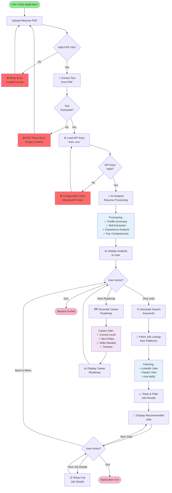
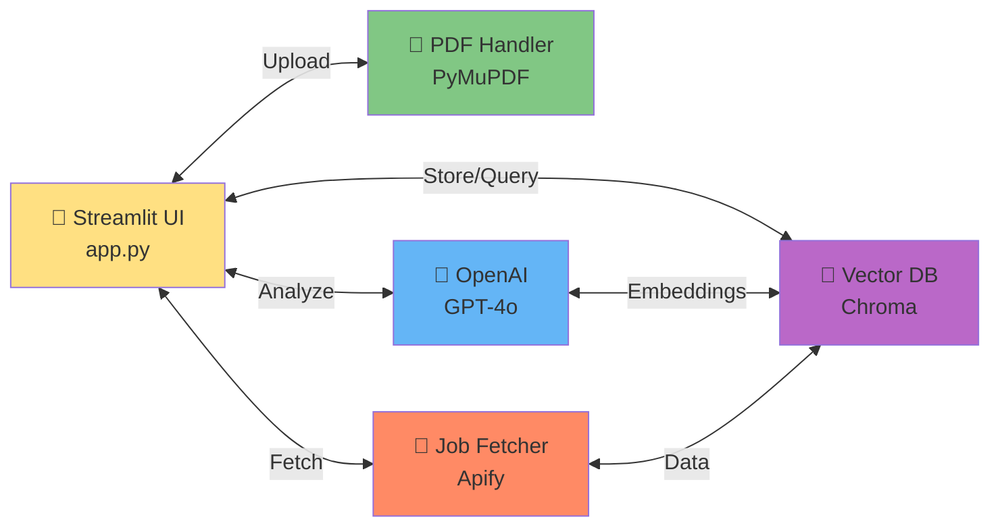
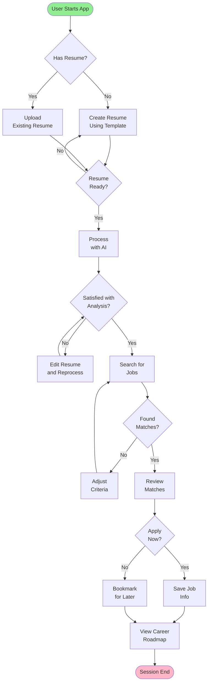
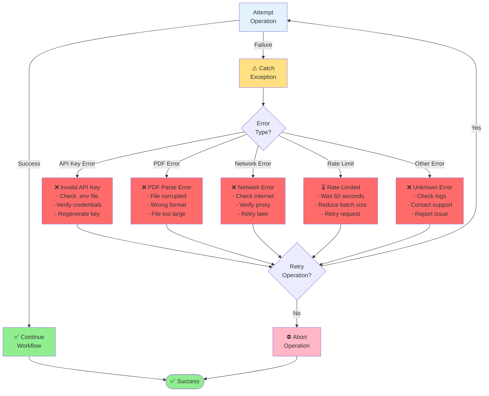

# System Flow Diagram

## Main System Workflow

This diagram shows the complete flow of the Real-Time Job Interoperability System from user input to job recommendations.

---

## Component Interaction

---

## Decision Tree

---

## Error Handling Flow

---

## See Also

- [Resume Processing Flow](resume_processing.md)
- [Job Matching Flow](job_matching.md)
- [Data Interoperability Flow](data_interoperability.md)

